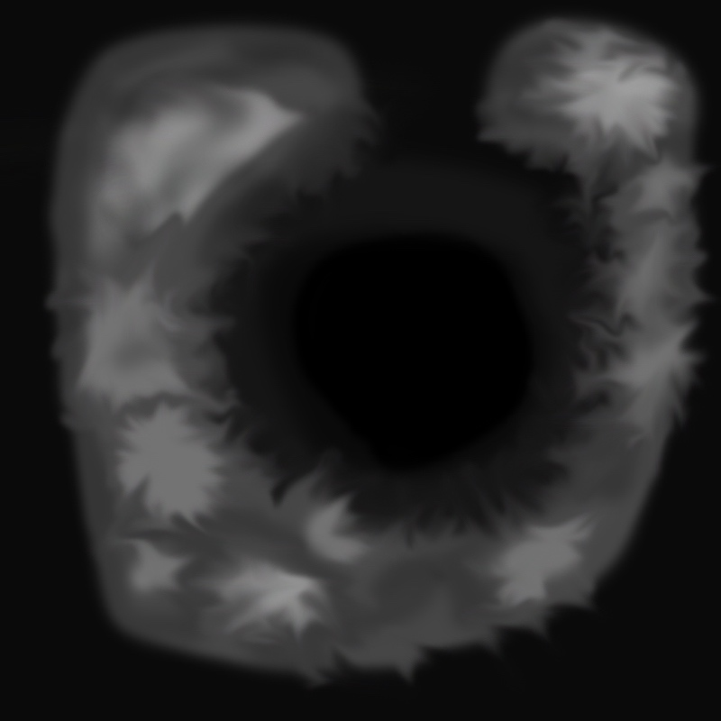
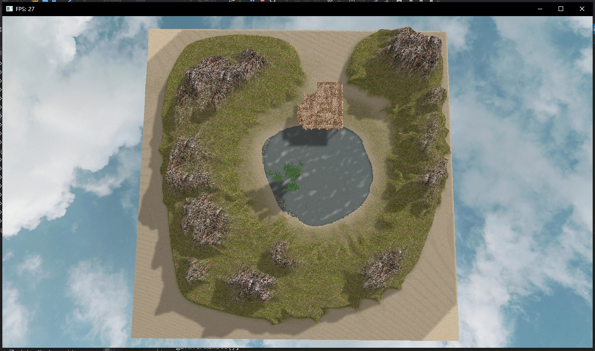

16340315朱俊凯
----

<h4>项目负责内容</h4>

-----

1.地形设计

* 因为地形一般都是NxN的网格构成，所以项目中的地形采用灰度图生成，灰度值表示对应的高度，这样就可以很容易的控制生成模型的高度。灰度图采用PS绘制：

* 首先生成平面三角网格，并将高度初始化为0。这里为了最小化地形网格顶点的数量，采用GL_TRIANGLE_STRIP的模式生成，即不生成重复的顶点，四个顶点生成两个三角形
* 因为我想给每个面指定唯一的法线，所以必须计算出顶点在每个面上的法线向量。在网格上每3个顶点构成一个面。通过这三个顶点，通过向量的叉乘就可以获得这个面的法线，以此类推，就可以得到每一个面的法线了。
* 然后读入灰度图，得到三角网格中每个顶点的高度，使用上述方法，根据坐标得到构成地形的所有面和法线。
* 然后绘制地形，并且根据不同的高度，以及地形的位置，加载不同的贴图的不同位置的部分，高的为一种地形贴图，低的部分则为另外一种，当中还有一些过度部分，则通过两种贴图的融合来实现，从而让整个过程更加的自然，从下至上依次是沙子——草地——岩石
* 结合法线信息和光照信息，结合之前的光照模型的实现，就可以给地形添加光照的反射和折射等效果了，以及还有阴影的信息。

2.粒子系统-雪

雪的粒子系统主要是基于opengl的transformfeedback这个功能。

* transform feedback是OpenGL渲染管线中，顶点处理阶段结束之后，图元装配和光栅化之前的一个步骤。transform feedback可以重新捕获即将装配为图元(点，线段，三角形)的顶点，然后你将他们的部分或者全部属性传递到缓存对象。每个顶点在传递到图元装配阶段时（之前），将所有需要捕获的属性数据记录到一个或者多个缓存对象当中（至于捕获那些数据，都是在我们控制之下的），程序可以通过缓存回读这些数据，或者将他们用于后续的渲染操作。
* 粒子程序分为两个处理过程，创建了2个着色器分别管理这两个过程。第一个负责渲染模型对象，第二个负责渲染粒子和实现粒子与模型对象的碰撞检测。在碰撞检测过程中用到的模型顶点数据就是将是通过transform feedback获取，而由于需要记录粒子的位置速度信息需要保留给当前渲染使用，单一缓冲无法对新数据进行记录，所以采用了双缓冲区，同样使用transform feedback来记录本次粒子渲染结果，给下一帧使用。
* 雪的分布，雪的散落通常是均匀分布的。所以初始化雪粒子的发射器的时候，指定一个区域XOZ平面，在这个区域内随机生成粒子坐标，这样就能生成均匀分布的雪花粒子发射器。
* 雪的运动，受到了重力和风力加速度的影响，所以它在加速度向量根据重力和风力的方向和大小进行变动。
* 雪的消亡，雪花落地即消亡，y<=0时粒子就消亡。
* 雪粒子大小是不一致的，所以也要保证粒子大小的随机性

<h4>个人总结</h4>

----

这次项目我主要负责这两部分，但是从中学到了很多，因为在以前的学习过程中，很多问题都没有考虑过，因此也遇到了很多问题等。首先是地形部分，在这一部分，本来以为通过灰度图生成的画很好理解，也好好实现，但是真的实现的时候，发现产生的地形没有很好的变化细节，整个地形显得过于平滑，看起来山也不像山，地也不像地，这一方面是使用的纹理图像素不太高，另一方面就是灰度图是随便ps。因此，就得话时间去把这些东西弄的更细致一点。这个过程也变得比较麻烦了。另外一部分，就是粒子系统的部分，因为这一部分平时没怎么碰过，所以学习和操作起来还挺多问题的，但是理解了transform feedback后，就好理解了一些，知道粒子系统通过这种方法将数据通过GPU来计算，并提取出来，这样就可以充分利用GPU的渲染来解决大量粒子变化的问题了。总的来说，这次项目对这学期的学习还是有了一定的巩固和提高的，包括之前的一些光照模型等，需要通过自己对面的处理，得到法向量之类的参数，然后用于光照效果的实现。对于整个opengl渲染场景的流程也多了一些熟悉，从数据的格式和处理方法，到渲染管线的工作流程，大致理解渲染的代码会在特定渲染阶段运行，并且可以在特定的阶段feedback回里面的数据。另外，最重要的还是感谢队友的合作和帮助，最终的项目由大家共同完成，与预期的效果还是比较接近的，就我自己来说十分满意。整个学期的计图课程也告一段落，从课上的理论学习到课外的实践，我学到了不少东西，就总结到这里吧~